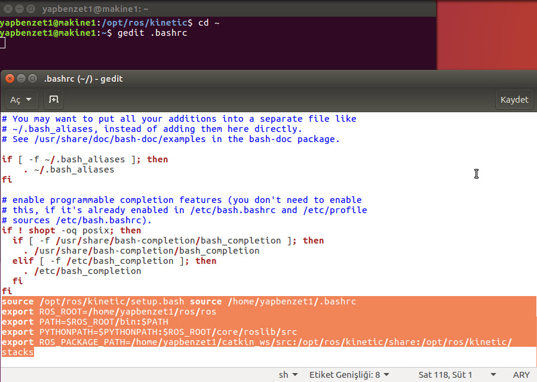

= Sanal Makineler Üzerinde Ubuntu + ROS + Gazebo

Okan Yücel <okan.yucel95@gmail.com> 

== 1.Gerekli Olan Dosyalar

İlk olarak sanal makineler oluşturabilmek için : https://www.virtualbox.org/wiki/Downloads[Virtual Box].

Birinci sanal makine üzerine kuracağımız işletim sistemi: https://www.ubuntu.com/download/desktop[Ubuntu 16.04].

İkinci sanal makine üzerine kuracağımız işletim sistemi: http://wiki.ros.org/turtlebot/Tutorials/indigo/ISO%20Installation[Ubuntu 14.04 with ROS indigo]

Üçüncü sanal makinemize ise birinci sanal makineye ROS Kinetic kurulumu yaptıktan sonra klonlayıp Gazebo kuracağız.

Windows üzerinde de matlab ile çalışacağız.

== 2. Sanal makine üzerinde işletim sistemi ayarları

.Birinci sanal makine Ubuntu 16.04 ayarları:
* 1024 MB Ram
* 32 MB Görüntü Belleği
* 1 CPU
* 30 GB Depolama Alanı

.İkinci sanal makine üzerinde Ubuntu 14.04 with ROS İndigo ayarları
* 1024 MB Ram
* 32 MB Görüntü Belleği
* 1 CPU
* 30 GB Depolama Alanı

Üçüncü sanal makine üzerinde ubuntu 16.04 ayarları

.Gazebo Kuralacağı için görüntü belleği, ram ve cpu önemli
* 2048 MB Ram
* 128 MB Görüntü Belleği
* 2 CPU
* 30 GB Depolama Alanı

*BÜTÜN SANAN MAKİNELERİN AĞ AYARINI KÖPRÜ BAĞDAŞTIRICI YAPMAYI UNUTMAYIN.*

== 3. ROS Kurulumu

Sanal makineleri kurduktan sonra birinci sanal makine Ubuntu 16.04 için ROS kurulumu yapalım.

=== 3.1 ROS depoları ve key

Öncelikle kurduğumuz Linux’da “sudo passwd” komutu ile root şifresini belirliyoruz “su” komutunu ve belirlediğimiz parolayı girerek root yetkisi alıyoruz.

Aşağıdaki kod ile Ros Kinetic sürümünün depolarını ekliyoruz.
[[source,linux]]
----
sudo sh -c 'echo "deb http://packages.ros.org/ros/ubuntu $(lsb_release -sc) main" > /etc/apt/sources.list.d/ros-latest.list'
----
Keyi belirliyoruz.
[[source,linux]]
----
sudo apt-key adv --keyserver hkp://ha.pool.sks-keyservers.net:80 --recv-key 0xB01FA116
----
=== 3.2 Güncelleme ve yükseltme
Güncellemeleri ve yükseltmeleri alalım.
[[source,linux]]
----
sudo apt-get update
sudo apt-get upgrade
----
=== 3.3 ROS Kinetic sürümü kurulumu
Son olarak aşağıdaki kodları ayrı ayrı girerek ROS Kinetic sürümünün Desktop-Full Install (ROS, rqt, rviz, robot-generic libraries, 2D/3D simulators, navigation and 2D/3D perception ) olanını kuruyoruz. Bu paket ile ROS kütüphaneleri 2D/3D simülatörler, navigatörler vs. yükleniyor. Bu işlem biraz zaman alacaktır(İnternet hızınıza göre 10-20 dk. Arası).
[[source,linux]]
----
sudo apt-get install ros-kinetic-desktop-full
sudo apt-get install ros-kinetic-desktop
----

==== 3.3.1 rosdep kütüphanesi
rosdep kütüphanesini kurmak için:
[[source,linux]]
----
apt install phyton-rosdep
----
Kurulumdan sonra çalıştırıp güncellemeleri alalım:
[[source,linux]]
----
sudo rosdep init
rosdep update
----
ROS’u her çalıştırmak istediğimizde kod girmemek için aşağıdaki kodu bir seferlik yazalım.
[[source,linux]]
----
echo "source /opt/ros/kinetic/setup.bash" >> ~/.bashrc source ~/.bashrc
----
son olarak aşağıdaki komut ile ros kurulumunu bitirelim:
[[source,linux]]
----
sudo apt-get install python-rosinstall
----

=== 3.4 Ortam değişkenlerinin tanımlanması

.ROS için tanımlamamız gereken ortam değişkenleri vardır bunlar için aşağıdaki kodları .bashrc dosyasına ekleyeceğiz. ( user yazan kısımlara kendi kullanıcı adınızı giriniz.)
[[source,linux]]
----
export ROS_ROOT=/home/user/ros/ros
export PATH=$ROS_ROOT/bin:$PATH
export PYTHONPATH=$PYTHONPATH:$ROS_ROOT/core/roslib/src
export ROS_PACKAGE_PATH=/home/user/ros/ros-pkg:/another/path
----

yukarıdaki kodları .bashrc dosyasına ekleyeceğiz. Aşağıdaki kod ile bashrc dosyasını açalım ve en sonuna ekleyelim.

[[source,linux]]
----
cd ~
gedit .bashrc
----

NOT: ROS_PACKAGE_PATH in farklı olmasını dikkate almayınız siz yukaradaki gibi yapın. catkin workspace oluşturduktan sonra sizde güncelleyeceksiniz.Şimdilik bu şekilde.

Sanal makine üzerindeki Ubuntu 16.04 için ROS Kinetic kurulumu burada bitmiştir.
