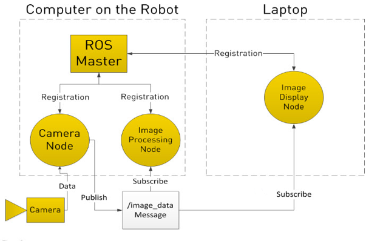

== ROS(Robot Operating System)

===	ROS Nedir?

ROS(Robot Operating System), isminden işletim sistemi gibi anlaşılsa da aslında değildir. ROS bilgisayar üzerinden robot bileşenlerini kontrol etmemizi sağlan BSD lisanslı bir yazılım sistemdir. Açık kaynak kodlu bir yazılımdır ve ROS’u kullanabilmemiz için Linux tabanlı bir işletim sistemine ihtiyaç vardır. Bu uygulamanın amacı robot ve programcı arasındaki ilişkiyi sağlamak ve belirli bir standart oluşturmaktır. ROS içinde barındırdığı standart kütüphanelerin ve desteklediği cihazların dışında, geliştiricler tarafından yazılmış kütüphanelere ve sürücülere de destek verdiği için her geçen gün kapsamını arttırmakta ve robot dünyasında standart konumunu almaktadır.

=== ROS Ne İşe Yarar?

ROS robotlarda yaygın olarak kullanılan bir yazılımdır. Kod üzerinden çok az değişiklik yaparak diğer robotlar üzerinde de çalışabilecek bir yazılım parçası geliştirmeyi hedefler. ROS sayesinde standart bir robot için yazılan standart bir algoritma yükle-kullan hızında çalıştırılabilir konumda olacaktır. Robota takılan sensörlerden alınan veri ROS ile bilgisayara ulaşacaktır, bilgisayarda işlenen veri robota bir görev olarak geri dönebilecektir. Aradaki bu haberleşme sistemi ROS arayüzündeki topicler ve mesajlar yardımıyla yapılacaktır. ROS, Gazebo simülasyon ortamıyla tam uyumlu olarak çalışmaktadır. Bu sayede projenin prototip aşamasında ROS Package haline getirilen geliştirilen veri yapısını test etmek için  Gazebo simülasyon ortamı hızlı bir geliştirme için kullanılabilir.

=== ROS’un Tarihçesi

ROS ilk olarak 2007 yılında Stanford Yapay Zeka Laboratuvarı’nda geliştirilmeye başlandı. Çalışmalar 2008 ve 2013 yılları arasında Willow Garage enstitüsünde devam etti. Bu süre içerisinden bu enstitüdeki mühendisler yirmiden fazla kurum ile görüşüp işbirliği yaptılar.[32] Bu kurumlar, donanım ekleyerek ve kod örnekleri ile ROS’ ta proje geliştirmeye başlamışlardır. Daha sonrasında ise robot üreten şirketlerde ROS’da kullanılmak için ürünlerini ROS’a adapte etmeye başlamışlardır.
2013 yılının şubat ayında ROS yönetimi OSR Vakfı bünyesine geçiş yaptı. Yine aynı yıl Ağustos ayında Willow Garage, Suitable Technologies adlı şirkete devredildi. Willow Garage Tarafından oluşturulan PR2’nin destek sorumlulukları da Clearpath Robotics tarafından alındı.[32] Tüm bu değişim ve gelişmelerin ardından robotlarda kullanılan sensörler ve aktuatörler de ROS ile kullanılmak üzere tekrardan uyarlanmışlardır. Her geçen gün ROS destekli cihazların sayısı artmaktadır.

=== ROS Nasıl Çalışır?
Bir ROS sistemi yayınlama/abone mesajlaşma modelini kullanarak diğer düğümler ile iletişim kuran düğümlerden oluşur. Bir ROS sistemi içerisinden birçok düğüm bulunabilir. Düğümler, hesaplama yapabilen işlemlerdir. Örneğin; bir düğüm kameradan görüntü alır, bir düğüm görüntüyü işler, bir düğüm görüntüyü görüntülenmesini sağlayabilir. Bu düğümlerin birbirlerinden haberdar olup birbirleri ile haberleşebilmeleri için ROS Master’a ihtiyaç vardır. ROS Master merkezi XML-RPC sunucusudur yani mesajları içeren ağ tabanlı bir yapıdır. Biraz daha ayrıntılı şekilde bu konuya açıklık getirecek olursak; ROS,  ROS Master ile başlar ve ROS düğümlerinin birbirlerini bulmasını ve birbirleriyle konuşmasını sağlar. Düğümler haberleşmeyi konular yayınlayıp bu konulara abone olarak gerçekleştirir. Diyelim ki robot üzerinden bulunan bir kameradan alınan görüntüleri robot üzerinde ya da başka bir bilgisayarda görmek istiyoruz. Kamera ile iletişim kurmak için bir kamera düğümü, görüntüleri işlemek için bir görüntü işleme düğümü ve görüntü gösterme düğümü vardır. Bu düğümlerin hepsi ROS Master’a kayıtlıdır. Kamera düğümü, ROS Master’a kayıt olurken /image_data adında bir konu yayınlayacağını belirtir. Diğer düğümler ise kameradan yayınlanan bu konuya abone olduklarını belirtir. Bu şekilde kamera düğümü kameradan alınan verileri /image_data konusu üzerinden mesajları diğer düğümlere iletir. Not: Bir düğüm birden fazla konu yayınlayabilir ve birden fazla konuya abone olabilirler. [33]

 
 
 

==== ROS’un Alternatifleri

ROS’a alternatif olabilecek başka robot yazılımları da mevcuttur. Bunlar Player, YARP, Orocos, Carmen, Orca, MOOS, Microsoft Robotic Studio.

==== Player
Robot ve sensör uygulamaları için ücretsiz yazılım araçları sunar. Amacı oyuncu projesi ile robot ve sensör sitemlerinden araştırma yapmayı sağlayan özgür yazılımı yaratmaktır. Ağ arabirimi sağlar, istemci/sunucu modeli mevcuttur. Herhangi bir programlama dili ile herhangi bir bilgisayardan robot ile ağ bağlantısı kurup eşzamanlı çalışmayı sağlar. Kullanılabilir son yayınlanan stabil sürümü 2010 yılında yayınlanmıştır.[35]

==== CARMEN

CARMEN, mobil robot kontrolü için açık kaynak kodlu bir yazılımdır. Sensör kontrolü, engelden kaçınma, yerleştirme, yol planlama ve haritalama gibi temel prensipleri sağlamak için tasarlanmış modüler bir yazılımdır. Kullanılabilir son yayınlanan stabil sürümü 2008 yılında yayınlanmıştır. [36]

==== ORCA

Orca, bileşen tabanlı robot sistemleri geliştirmek için açık kaynak kodlu bir yazılım sunmuştur. Kullanılabilir son yayınlanan stabil sürümü 2009 yılında yayınlanmıştır.[37]

==== Microsoft Robotics Studio

Robotik uygulamaları oluşturmak için oluşturulmuş .NET tabanlı programlama ortamıdır. Akademik, hobi ve ticari geliştiricilere yöneliktir. Kullanılabilir son stabil sürümü 2012 de yayınlanmıştır. Windows 7 gerektirir. Windows 8 Consumer Preview’da test edildi ancak Windows 8’in son sürümüne kadar bile desteklenmedi.[38]

==== Neden ROS?

Neden diğer X yazılımı değil de ROS? Bu soru birçok cevaba sahiptir. Kısa ve net bir cevap şu şekilde olabilir.

ROS ( Robot Operating System ) adının çağrıştırdığının aksine işletim sisteminden ziyade bir arayüz olarak tanımlayabileceğimiz bir uygulamadır. Bu uygulamanın amacı robot ve programcı arasındaki ilişkiyi sağlamak ve belirli bir standart oluşturmaktır. ROS içinde barındırdığı standart kütüphanelerin ve desteklediği cihazların dışında, geliştiricler tarafından yazılmış kütüphanelere ve sürücülere de destek verdiği için her geçen gün kapsamını arttırmakta ve robot dünyasında standart konumunu almaktadır. ROS’un sunduğu bir diğer avantaj ise yazılan kodlar her robota ayrı olarak yazılmasının yerine bir kere yazılan kodun desteklenen bütün cihazlarda çalıştırılabilmesidir. Bu şekilde alınan standart bir robot için yazılan standart bir algoritma yükle-kullan hızında çalıştırılabilir konumda olacaktır. Robota takılan sensörlerden alınan veri ROS ile bilgisayara ulaşacaktır, bilgisayarda işlenen veri robota bir görev olarak geri dönebilecektir. Aradaki bu haberleşme sistemi ROS arayüzündeki topicler ve mesajlar yardımıyla yapılacaktır. ROS, Gazebo simülasyon ortamıyla tam uyumlu olarak çalışmaktadır. Bu sayede projenin prototip aşamasında ROS Package haline getirilen geliştirilen veri yapısını test etmek için  Gazebo simülasyon ortamı hızlı bir geliştirme için kullanılabilir.

Diğer avantajları maddeler halinde aşağıda listelenmiştir.

•	ROS’un amacı kodu desteklemek olduğu için yeniden kullanımlığı arttırır ve size her projede tekerleği sıfırdan icat etmeniz konusunda diretmez.
•	İki işletim sistemi arasında çalışabilir. Örneğin; robot üzerinden oluşturduğunuz ROS Master’a Windows üzerinde kurulu olan MATLAB’tan robota kod gönderebilir ve robottan geriye veri döndürebilirsiniz. Bu sadece ROS sizi sadece Linux kullanmaya zorlamaz ve diğer işletim sistemlerinin sunduğu kolaylıklardan da yararlanabilirsiniz.
•	Dil bağımsızdır. C++, python, lisp, java, lua gibi birçok farklı programlama dilini desteklemektedir ve sizi belirli bir programlama dilini öğrenmeye zorlamaz.
•	Açık kaynak kodludur. Size sunduğu topluluk deposundaki güçlü araçları dilediniz gibi kullanılıp yeniden düzenleyebilirsiniz. Bunlardan ön önemlileri görselleştirme, simülatörler ve hata ayıklama araçlarıdır.
•	Her geçen gün destekledi robot ve sensör sayısı artmaktadır.
•	Platformlar arası çalışabilir. Oluşturduğumuz düğümleri farklı programlama dillerinde yazabiliriz. Bir düğüm C++ iken diğer düğüm java yada python olabilir.
•	Modülerdir. Diğer robot uygulamalarının çoğunda bir sorun çıktığında bu sorun ana kodun kitlenmesine sebep olup robot uygulamasını durdurabilir. Fakat ROS’ta durum böyle değildir. ROS’ta her işlem için bir düğüm olduğundan dolayı bir düğüm bozulduğunda diğer düğümler çalışmaya devam eder.
•	Her bir işlem için ayrı konu yayınlandığı için karmaşıklığı azaltır. Bu sayede hata ayıklamayı kolaylaştırır.
•	Aktif bir topluluğa sahiptir. ROS ile ilgili birçok kaynak, doküman, kitap, makale, bildiri bulabilirsiniz.
•	2014 yılında yayınlanan İndigo sürümü 2019, 2016 yılında yayınlanan Kinetic Kame sürümü 2021 yılına kadar desteklenmektedir.
•	ROS FastSLAM 2.0 algoritmasını GMapping paketinin altında desteklemektedir. [34]

=== ROS’un Destekledikleri Robotlar[39]

•	0x Alpha,0x Delta by Nex Robotics
•	210,220 Stanley Innovation V3 Segway
•	223,224,444 Innok Heros
•	420 Omni Stanley Innovation V3 Segway
•	440LE, 440SE  Stanley Innovation V3 Segway
•	ABB Robotics (ROS-Industrial)
•	Adept MobileRobots Pioneer family (P3DX, P3AT, ...),  Pioneer LX , Seekur family (Seekur, Seekur Jr. 
•	Aldebaran Nao
•	Allegro Hand SimLab
•	AMIGO
•	AR10 Robotic Hand
•	AscTec Quadrotor
•	ASIMoV Robotics X-Terrabot
* AUBO Robotics
•	Barrett Hand
•	BIG-i
•	BipedRobin
•	Bitcraze Crazyflie
•	Blue Robotics BlueROV
•	Clearpath Robotics Grizzly, Husky, Jackal , Kingfisher, Ridgeback, Warthog 
•	Cogniteam Hamster
•	Commonplace Robotics Manipulation Platform,Mover , SRA Service Robot Arm 

•	CoroWare Corobot
•	Cyton-Gamma
•	Dataspeed ADAS Development Vehicle, Mobility Base  
•	Denso VS060
•	Dr. Robot Jaguar
•	Eddiebot
•	Enova Robotics MiniLab
•	Erle-Brain, Brain 2, Copter , Copter Ubuntu Core special edition , HexaCopter, Plane , Rover, Spider 
•	evarobot
•	Fanuc Robotics (ROS-Industrial)
•	Festo Didactic Robotino
•	Fetch robotics: Fetch, Freight 
•	Fraunhofer IPA Care-O-bot 3
•	Fraunhofer IPA Care-O-bot 4
•	GeRo (open source humanoid robot)
•	Gostai Jazz
•	GoThere! Robot
•	Han's Robotics
•	i-Cart mini
•	Ingeniarius ForteRC
•	Innok Heros
•	Intel Edison
•	iRobot Roomba
•	Kawada Nextage / Hiro
•	Kinova JACO, MICO 
•	Kobuki
•	Lego NXT
•	Maggie
•	Mecanumbot
•	Merlin miabotPro
•	Milvus Robotics ATR, MRP2, Robin 
•	Motoman, Yaskawa (ROS-Industrial)
•	Nav2
•	Navio2
•	Neobotix mp-500, mpo-500, mpo-700   
•	Open Unit Robot
•	Otto Bock SensorHand Speed
•	PAL Robotics PMB-2, Robotics REEM-C , Robotics TIAGo 
•	RazBot
•	REEM
•	Robonaut 2
•	RoboSavvy Self-balance platform
•	RoboTiCan ARMadillo, Komodo , Lizi 
•	ROBOTIS Manipulator-H, Thormang3
•	Robotnik AGVS, CROM , GUARDIAN , RB-1, RB-1 BASE , RBCAR , SUMMIT XL , SUMMIT-X SUMMIT-X  
•	Roch
•	ROS-Industrial
•	Ros2Bot
•	Shadow Hand
•	Softbank Pepper
•	Spark
•	TUlip
•	TurtleBot
•	Universal Robots (ROS-Industrial)
•	Videre Erratic
•	WheeledRobin
•	Willow Garage PR2
•	Xaxxon Oculus Prime
•	Xbot
