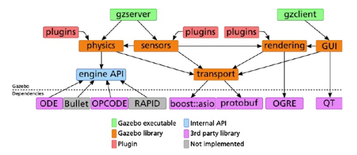

== Simülatörler

=== V-Rep

V-REP herhangi bir robot sisteminin yazılımsal ve ya donanımsal simülasyonunu oluşturabileceğimiz bir simülasyon ortamıdır. 
İçerdiği fonksiyonlar, özellikler, kütüphaneler ve özel API’leriyle birlikte piyasadaki çoğu simülatörden çok daha güçlü bir deney ortamı sağlamaktadır. 
Her bir nesne script, plugin, ros node ve ya başka bir teknikle kontrol edilebilmektedir. 
Windows, Mac, Linux gibi işletim sistemlerinde çalışabilmektedir. 
Fiziki ortamını ODE,BULLET ve VORTEX gibi kütüphaneleri kullanarak sağlamaktadır. 
Kontrol ediciler, kontrol yazılımını geliştirmek için C/C++, Pyhton, Java, Lua, Matlab gibi dilleri kullanabilmektedirler. 
Simülatörün kendi içerisinde fiziksel robotları da mevcuttur. 
E-puck, hexapot, Nao gibi robotlar simülasyonun içinde hazır olarak bulunmaktadırlar. 
V-REP simülasyon robot simülasyonunun yanı sıra robot kol simülasyonu da yapabilmektedir. 
Kuka, Jabo gibi robot kollarını hazır olarak sunmaktadır. 3D tasarım yapılmasına olanak sağlamaktadır. 
Sensör desteği sağlamaktadır. İçerisinde bulunan sensörleri geliştirilen robota monte etme imkanı sağlamaktadır. 
Proximity, Vision, Force gibi sensörleri içerisinde barındırmaktadır. 

Mevcut ürünleri;
•	V-REP Player
•	V-REP Pro
•	V-REP Pro Edu
•	V-REP Source Code Educational
•	V-REP Source Code Commercial

=== Webots

3D fiziksel çevre desteğini sağlayan WEBOTS genellikle akademik çalışmalarda kullanılmaktadırlar. 
İçerdiği kütüphaneler farklı fiziksel çevre modellerini ve robotları barındırır. 
İçerdiği fiziksel robotlar V-REP’ teki robotlara benzerdir. E-puck, Nao, Khepera bunlardan bazılarıdır. 
Kontrol yazılımları kendi editöründe geliştirilmektedir. Kontrol yazılımlarını geliştirmek için dil ortamdan bağımsızdır.
C/C++, Java, Python gibi dilleri kendi editöründen derleyebilmektedir. V-REP’e göre arayüzü daha basit ve kullanışlıdır. 
Kontrol yazılımları uygulanmış robotun ekran çıktılarını video ve ya resim olarak alabilme imkanı sunmaktadır. 
İşletim sisteminden bağımsızdır. Windows, Linux ve Mac altında çalışabilmektedir. 
Geliştirilen MATLAB arayüzü ile program kodlarını MATLAB ortamında çalıştırma imkanı sağlamaktadır. 
Sensör verilerini almak ve kontrol yazılımında işlemek oldukça basittir. 
İçerisindeki kütüphaneler sensör verilerini işleyecek geniş fonksiyonlara sahiptir. 

=== Gazebo

Gazebo projesi 2002 yılında California’da Dr. Andrew Howard ve öğrencisi Nate Koenig tarafından başlatılmıştır. Linux ortamında geliştirilmiştir. 2009 yılında ise Jhon Hsu tarafından ROS ve PR2 Gazeboya entegre edilmiştir. Bu entegre sürecinden sonra Gazebo gittikçe tercih edilen bir simülatör olma özelliğini kazanmıştır. Apache 2.0 lisansıyla lisanslanmıştır.
Hem kapalı hem açık mekanlar için geliştirilmiş açık kaynak kodlu, ücretsiz bir robot deney ortamıdır. Birden fazla robotu 3D ortamda simüle edebilme özelliğine sahiptir. V-REP gibi ODE, Bullet, Simbody, DART gibi kütüphaneleri sayesinde fiziksel ortamı işlemekte çok fazla yeteneklidir. Sahneleme işlemini ise açık kaynak kodlu grafik motoru OGRE’yi kullanmaktadır. Sahnelemede en iyi performansı NVIDIA GPU’lar vermektedir. 
Gazebonun mimari yapısı ise diğer simülatörlere göre daha net bir şekilde işlevselleşmiştir. Her işlev farklı kütüphanelerle birbirinden farklı kılınmıştır.

•	Fizik
•	Sahneleme
•	Sensör
•	Taşıma
•	GUI

 

Gazebo temelinde istemci sunucu ilişkisiyle çalışmaktadır. Sunucu(gzserver) fiziksel işlemleri yaparken(robot ortamı gezerken), istemci(gzclient) kullanıcının etkileşimini ve simülasyonun görselleştirilmesini sağlar.  
Gazebonun kullanıcı arayüzü ise V-REP simülasyon ortamına göre daha az gelişmiştir. Ancak ROS’un içerisinde entegreli olması V-REP ile arasındaki farkı kapatmaktadır.  
Gazebo kontrol yazılımı geliştiricilerine C++ gibi dillerde geliştirme yapma imkanı sağlamaktadır. Kod derlenmesi Linux ortamında olacağı için yazılım geliştiricilerin bu dillere hakim olması geliştirmeyi hızlandırmak için önemli bir kriter olmaktadır. 
Gazebo platformu yüklendikten sonra kendi online veritabanından ulaşabileceğimiz bir çok fiziksel ortam ve fiziksel robotu beraberinde getirmektedir. Bu robotların sayısı oldukça fazla ve ROS’la birlikte çalışabilmektedir. Pioneer, iRobot gibi robotlara Gazebonun online veritabanından ulaşabiliriz. Bunun yanı sıra kendi robotumuzu oluşturma fırsatını bize tanımaktadır. Model.config ve model.sdf dosyalarının içerisini XML kodlarıyla oynayarak değiştirebiliriz. Bu sayede fiziksel robotlara istediğimiz sensörleri ekleme imkanına ulaşılabilmektedir. Bu modellemeler için SDF ve URDF formatlarını desteklemektedir.
Gazebo, sensör desteği ve gerçekleme bakımından diğer simülasyon ortamlarına göre daha verimli çalışır. Sensörlerden veri alınırken gürültünün hesaba katılması gerekmektedir. Fiziksel ortamlarda gürültüsüz veriye ulaşılması mümkün değildir. Bu yüzden simülasyon ortamında ideal robot tasarımı için sensörlerin gürültülü veri üretmesini sağlamamız gerekmektedir. Gazebo gürültü eklenmiş sensörlere imkan sağlamaktadır. 
ROS entegrasyonun olması ve ROS içerisinde gömülü olması sebebiyle Gazebo yazılım geliştiricileri için sıklıkla tercih edilen bir simülasyondur.

=== Diğer Simülatörler

*ARS:* Pytonla yazılmış olan bir simülasyon ortamıdır. Geliştiricilere kodlarını Python’la yapma imkanı sunulmaktadır.

*MORSE:* ARS gibi Python temelli bir simülasyon ortamıdır. ROS desteği sağlamaktadır. Kullanıcı arayüzü ise komut penceresinden yönetilebilmektedir. 

*OpenHRP:* Ana programlama dili C++’ dır. Model dosyalarında VRML formatını kullanmaktadır. C++,Java gibi dillerde kontrol yazılımı geliştirme imkanı sunmaktadır.

*Sim Spark:* Ana programlama dili C++ ve Rubydir. Ruby Scene Graphs formatında modelleme yapılmaktadır. 
